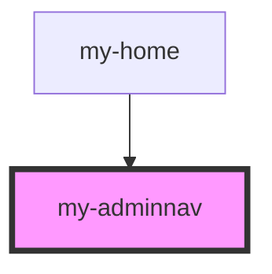

# my-adminnav

<!-- Auto Generated Below -->

## Properties

| Property     | Attribute     | Description | Type     | Default     |
| ------------ | ------------- | ----------- | -------- | ----------- |
| `backColor`  | `back-color`  |             | `string` | `'#ffffff'` |
| `fontFamily` | `font-family` |             | `string` | `'Arial'`   |
| `fontSize`   | `font-size`   |             | `string` | `'16px'`    |
| `textColor`  | `text-color`  |             | `string` | `'#000000'` |

## Dependencies

### Used by

 - [my-home](../my-home)

### Graph

----------------------------------------------

*Built with [StencilJS](https://stenciljs.com/)*
