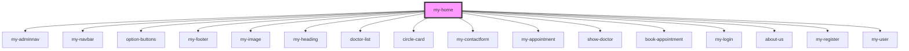

# my-home

<!-- Auto Generated Below -->

## Dependencies

### Depends on

- [my-adminnav](../my-adminnav)
- [my-navbar](../my-navbar)
- [option-buttons](../option-buttons)
- [my-footer](../my-footer)
- [my-image](../my-image)
- [my-heading](../my-heading)
- [doctor-list](../doctor-list)
- [circle-card](../circle-card)
- [my-contactform](../my-contactform)
- [my-appointment](../my-appointment)
- [show-doctor](../show-doctor)
- [book-appointment](../book-appointment)
- [my-login](../my-login)
- [about-us](../about-us)
- [my-register](../my-register)
- [my-user](../my-user)

### Graph

----------------------------------------------

*Built with [StencilJS](https://stenciljs.com/)*
